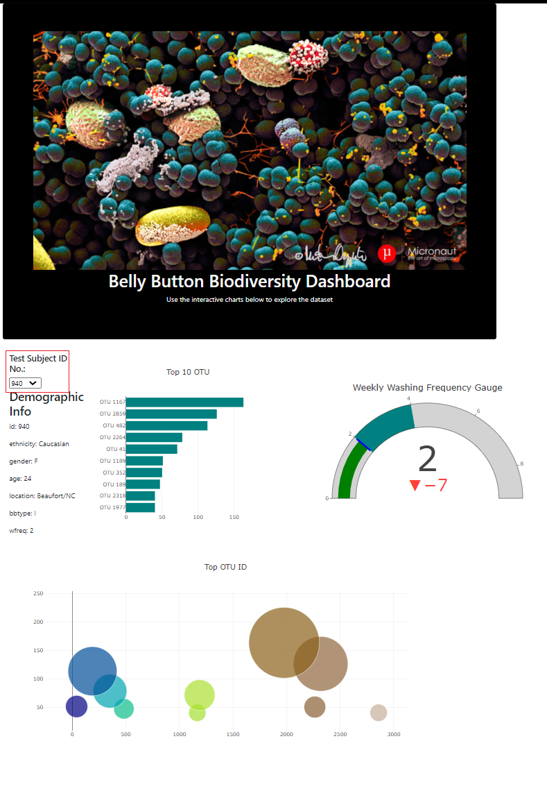

# BellyButtonDemographics

## Purpose of the dashboard
to hel Roza's test volunteers visualize the bacterial data for each test. 
Specifically, her volunteers should be able to identify the top 10 bacterial species in their belly buttons.
That way, if Improbable Beef identifies a species as a candidate to manufacture synthetic beef, 
Roza's volunteers will be able to identify whether that species is found in their navel.

## Guide
- Please refer below on how to navigate through the html dashboard.
	* The dashboard features 3 different sets of plots, along with a " Test Subejct ID" selector. 	
		- To change from volunteers use the Subject ID drop down menu to change frome all volounteers.

		- The first table will populate the top 10 OUT bacteria in a horizontal bar graph.

		- The next table will populate the "weekly washing" average of every volounteer.

		- The last table show a bubble plot of the top OTU ID. 
			* This plot helps to visually see the users top OTU ID type on a focal perspective.
			* 
		
	* Once a different test vouluteer is selected the plots and data will auto populate with their perspectivedata.